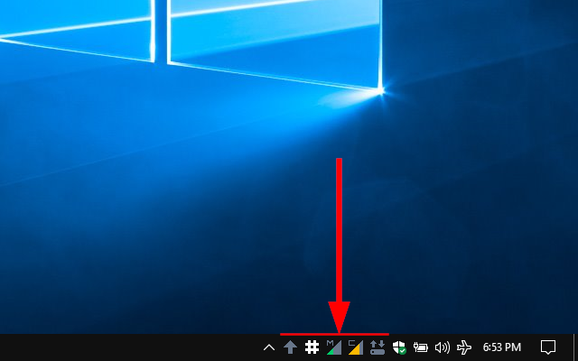

 
 
*A lean system tray monitor for your Windows machine*

### Download SysTray
**[DOWNLOAD the latest version](https://github.com/david-osborne/SysTray/releases/tag/v0.1-beta)**  *Executable (.exe) download - currently unsigned*

### What is SysTray?
 
Systray is a little application that runs in Windows system tray, and provides you with some helpful information about the state of your machine:
- CPU-Processor usage
- RAM-Memory usage
- Disc drive(s) read/write activity
- Caps Lock key state
- Num Lock key state

### Why SysTray?
Many Windows users want to know at a glance how their computer is performing.  Windows does not come with such functionality 'out of the box' - thus SysTray

### How much does it cost?
SysTray is Free and Open Source Software (FOSS).  It's yours to use freely.  I hope you find it useful and enjoyable.

**No spyware.  No keyloggers.  No cryptomining.  No malware.  No adware.  No evil supervillians.**

Just a simple application to add some functionality to your Windows computer.

### Support or Contact

Having trouble with SysTray?  [Contact me](mailto://david.osborne@outlook.com) and I’ll help you sort it out.
