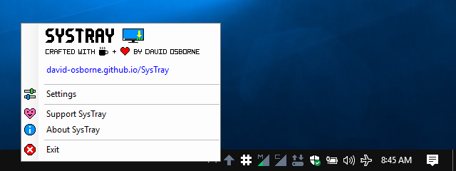
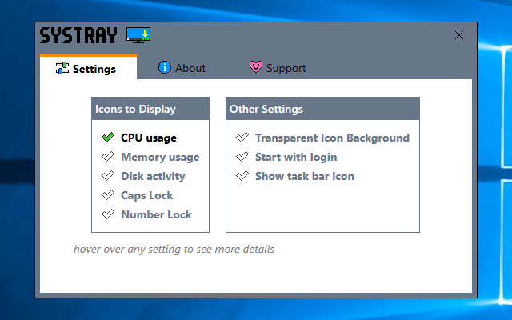

 
### What is SysTray?
 
Systray is a little application that runs in the Windows system tray, and provides you with some helpful information about the state of your machine.
### Why SysTray?
Many Windows users want to know at a glance how their computer is performing.  Windows does not come with such functionality 'out of the box' - thus SysTray
### How much does it cost?
Nothing.  SysTray is yours to use freely.  I hope you find it useful and enjoyable.
### SysTray Features:
- CPU-Processor usage
- RAM-Memory usage
- Disc drive(s) read/write activity
- Caps Lock key state
- Num Lock key state

**No spyware.  No keyloggers.  No cryptomining.  No malware.  No adware.  No evil supervillians.**

Just a simple application to add some functionality to your Windows computer.
##### Right click on the icons to see a context menu 

##### Configurable to your liking 

### Support or Contact
Having trouble with SysTray?  You can either **[file an issue](https://github.com/david-osborne/SysTray/issues/new/choose)** here on GitHub, or **[contact me](mailto://david.osborne@outlook.com)** and I’ll help you sort it out.

### Download SysTray
**[DOWNLOAD the latest release](https://github.com/david-osborne/SysTray/releases/latest)**  *Executable (.exe) download - currently unsigned*
